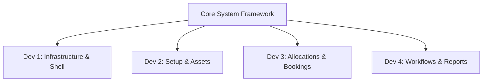

# Team Work Division - AssetFlow ERP

To develop the **AssetFlow** Enterprise Asset & Resource Management System efficiently within a 4-person team, we have structured the responsibilities by functional areas. This ensures clean interface boundaries, minimal merge conflicts, and clear ownership.

## Team Role Assignments

| Role / Team Member | Primary Module Focus | File Ownership | Key Tasks / Screen Deliverables |
| :--- | :--- | :--- | :--- |
| **Developer 1 (Lead & UI/UX)** | Core Shell, UI Design, Global State | [index.html](file:///C:/Users/ayush/.gemini/antigravity/scratch/assetflow/index.html) [styles.css](file:///C:/Users/ayush/.gemini/antigravity/scratch/assetflow/styles.css) [app.js](file:///C:/Users/ayush/.gemini/antigravity/scratch/assetflow/app.js) | <ul><li>App skeleton, navigation sidebars & header</li><li>Vanilla CSS Design System (dark theme, glassmorphism, responsive grid)</li><li>Routing, global Toast manager, Modals & Drawer layout</li><li>Activity logs visual timeline & Dev Switcher</li></ul> |
| **Developer 2 (Backend Mock)** | Database Seeding, Directory, Auth | [db.js](file:///C:/Users/ayush/.gemini/antigravity/scratch/assetflow/db.js) [screens.js](file:///C:/Users/ayush/.gemini/antigravity/scratch/assetflow/screens.js) *(Auth, Org, Dir)* | <ul><li>Mock localStorage database structure & seeding data</li><li>Login / Signup screens (default Role restriction)</li><li>Organization Setup Screen (Tab A: Depts, Tab B: Cats, Tab C: Directory)</li><li>Employee promo actions & active/inactive states</li><li>Asset Registry Form (next tag gen) & filter directories</li></ul> |
| **Developer 3 (Operations)** | Asset Allocation & Resource Booking | [screens.js](file:///C:/Users/ayush/.gemini/antigravity/scratch/assetflow/screens.js) *(Allocations, Bookings)* | <ul><li>Asset Allocations summary list & checking return modal</li><li>Conflict validation (Block double-allocations + Suggest Transfer)</li><li>Inter-Employee Transfer Request approvals workflow</li><li>Resource Booking Timeline (Hour spans 8am - 6pm)</li><li>Overlap validation logic</li></ul> |
| **Developer 4 (Verification)** | Maintenance, Auditing & Analytics | [screens.js](file:///C:/Users/ayush/.gemini/antigravity/scratch/assetflow/screens.js) *(Maintenance, Auditing, Reports)* | <ul><li>Maintenance / Repair ticket workflow (Assign Tech, Resolve notes)</li><li>Audit Cycle creation & Auditor Logging checklist</li><li>Auto discrepancy reports & updating statuses to "Lost" on close</li><li>Reports & Analytics (Utilization progress bars, Hourly Booking Heatmap)</li><li>CSV Export implementation</li></ul> |

---

## Integration Plan & Interface Boundaries

1. **Database Schema (`db.js`)**: Developer 2 defines and seeds the schema first. All other developers query or mutate this state strictly via `AssetFlowDB.getAll()`, `AssetFlowDB.insert()`, `AssetFlowDB.update()`, and logging helper functions.
2. **Main Router (`app.js`)**: Developer 1 defines the `navigateTo(route)` function. Developers 2, 3, and 4 register their screen renders under matching names (e.g. `renderDashboard`, `renderOrgSetup`) in `screens.js`.
3. **Global Modals & Toasts**: To display forms or messages, developers call Developer 1's global helper functions: `openModal(title, bodyHTML, footerHTML)`, `closeModal()`, and `showToast(msg, type)`.
